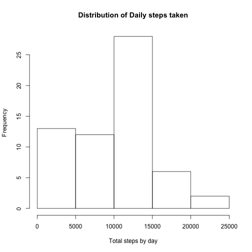
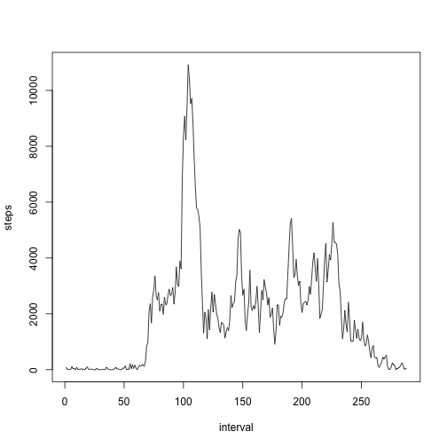
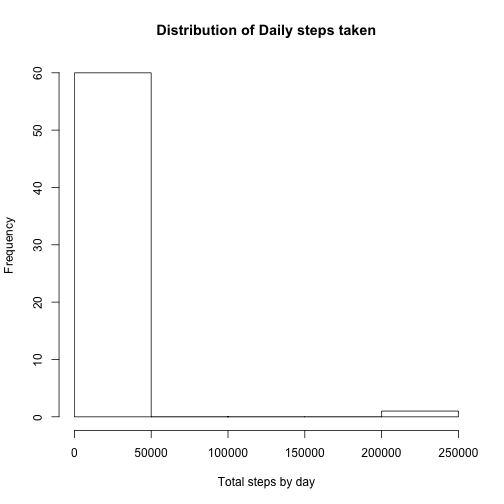
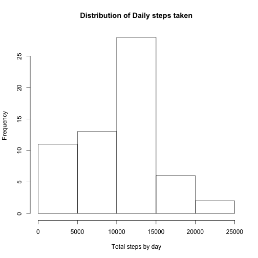
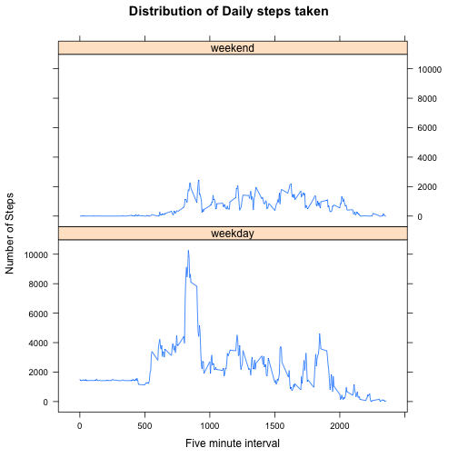

# Reproducible Research: Peer Assessment 1


## Loading and preprocessing the data

```r
library(plyr)
data <- read.csv("activity.csv")
data$dateTime <- strptime(paste(data$date, "00:00:00"), "%Y-%m-%d %H:%M:%S") + 
    data$interval * 5
data$wday <- weekdays(data$dateTime)
totalStepsByDay <- ddply(data, ~date, summarise, steps = sum(steps, na.rm = T))
totalStepsByFiveMinutes <- ddply(data, ~interval, summarise, steps = sum(steps, 
    na.rm = T))
totalStepsByFiveMinutes$interval <- as.numeric(row.names(totalStepsByFiveMinutes))

# data$date <- as.Date(data$date) data$interval<-factor(data$interval)
```


## What is mean total number of steps taken per day?

```r
hist(totalStepsByDay$steps, xlab = "Total steps by day", main = "Distribution of Daily steps taken")
```

 

```r
xbar <- round(mean(totalStepsByDay$steps, na.rm = T), 2)
x2 <- median(totalStepsByDay$steps, na.rm = T)
```

  The mean number of steps per day is **9354.23** and the median is **10395**.
  
## What is the average daily activity pattern?

```r
plot(totalStepsByFiveMinutes, type = "l")
```

 

```r
maxSteps <- totalStepsByFiveMinutes[totalStepsByFiveMinutes$steps == max(totalStepsByFiveMinutes$steps), 
    ]$interval
maxStepsHours <- maxSteps * 5/60
```

The five-minute interval with maximum number of steps is **104th** minute (**8.6667 hour**).


## Imputing missing values

```r
totalMissing <- sum(is.na(data$steps))
# use mean by interval for missing values
data$stepsImputed <- merge(data, totalStepsByFiveMinutes, by = "interval", all.x = T)$steps.y
data[!is.na(data$steps), ]$stepsImputed <- data[!is.na(data$steps), ]$steps
# use mean by day for the rest of the missing hours
data[is.na(data$stepsImputed), ]$stepsImputed <- merge(data, totalStepsByDay, 
    by = "date", all.x = T)[is.na(data$stepsImputed), ]$steps.y
```

The total number of missing values is **2304**.

```r
totalStepsByDayImputed <- ddply(data, ~date, summarise, steps = sum(stepsImputed))
hist(totalStepsByDayImputed$steps, xlab = "Total steps by day", main = "Distribution of Daily steps taken")
```

 

```r
xbar2 <- round(mean(totalStepsByDayImputed$steps), 2)
x4 <- median(totalStepsByDayImputed$steps)
```

The imputed mean is **1.3175 &times; 10<sup>4</sup>** and median is **10439**, while the mean with missing values removed was **9354.23** and median was **10395**. The histogram suggests there are some **outliers** so if we filter for those with less than 100K steps we would see the real distribution.

```r
hist(totalStepsByDayImputed[totalStepsByDayImputed$steps < 1e+05, ]$steps, xlab = "Total steps by day", 
    main = "Distribution of Daily steps taken")
```

 

The difference in mean is -3820.61 and for median is -44.
## Are there differences in activity patterns between weekdays and weekends?

```r
data$dayType <- gsub("Saturday|Sunday", "weekend", data$wday)
data$dayType <- factor(gsub("Monday|Tuesday|Wednesday|Thursday|Friday", "weekday", 
    data$dayType))
totalStepsByDayType <- ddply(data, interval ~ dayType, summarise, steps = sum(stepsImputed))
library(lattice)
xyplot(totalStepsByDayType$steps ~ totalStepsByDayType$interval | totalStepsByDayType$dayType, 
    type = "l", main = "Distribution of Daily steps taken", ylab = "Number of Steps", 
    xlab = "Five minute interval", layout = c(1, 2))
```

 


